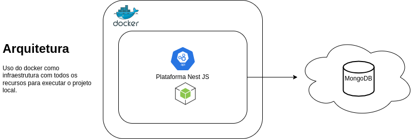

<h1 id="logo" align="center">
  
   
  Project Antifraud Provider
</h1>
<h2> Iniciando o projeto </h2>

  <li>Para rodar o container docker: <code>npm run start:docker</code></li>

  <li>Antes de executar o serverless-framework possuir ele instalado
  <code>npm install -g serverless</code></li>

  <li>Instalar as dependências usar o comando: <code>npm i</code> ou <code>yarn</code></li>

  <li>Para rodar o serverless offline: <code>npm run start:sls</code></li>

  The <b> Antifraud Provider </b>is a set of definitions to help you integrate your team consume our <b> services of API</b> with maximum agility. 

  O Provedor de Anti-fraude é um conjuto de definições para ajudar você a integrar seu time consumindo nossos <b> serviços de API </b>com o máximo de agilidade.

<h2>
  Contextualização do Problema
</h2>
Atualmente o time de análise antifraude do ecommerce realiza um controle de CPFs em
uma planilha eletrônica. Nesta planilha são adicionados CPFs com risco de fraude. Com o
aumento da nossa base de clientes têm ficado cada vez mais difícil manter o controle
manual.

<h2>
  Requisitos funcionais
</h2>
<table>
  <tr>
    <td> User Story </td> 
    <td> Funcionalidade </td>
  </tr>
  <tr>
    <td>
     US1
    </td>
    <td>
      <a href="./documentation/US1.md" target=""_blank>
       Adicionar CPF na lista restrita
      </a>
    </td>
  </tr>
  <tr>
    <td> US2</td>
    <td> 
      <a href="./documentation/US2.md">
       Verificar se um determinado CPF está na lista restrita
      </a>
    </td>
  </tr>
  <tr>
    <td> US3</td>
    <td>
      <a href="./documentation/US3.md">
        Remover um CPF da lista restrita
      </a>
    </td>
  </tr>
  <tr>
    <td>
     US4
    </td>
    <td>
      <a href="./documentation/US4.md">
       Visualizar todos os CPFs que estão na lista restrita
      </a>
    </td>
  </tr>
</table>
<h2>
  Requisitos não funcionais
</h2>
<li> A aplicação expoẽ suas funcionalidades em um serviço Restful utlizando o formato JSON
</li>
<li>
A plantaforma de desenvolvimento é em Node.js (Javascript/Typescript).
<li>
 O Framework utilizado é o <b>Nest.JS</b> quem tem o foco maximizar a produtividade na criação de <b>API's RESTful</b>
</li>
<li>
  O Banco de dados usado é o mongoDB
</li>
<li>
  Uso de TDD para manter uma documentação de como o código foi construido, reduzir falhas e testar unitáriamente da forma mais eficaz os critérios de aceite.
</li>
<li>
  Uso de container <b> Docker </b> para ter o ambiente local pré-configurado similar ao ambiente produtivo.
</li>

<h2>
  Framework - Serverless e Nest JS
</h2>
A escolha de serviços serverless AWS é a melhor escolha para a  solução no nível de infraestrutura, principalmente por ter:

<li>Um custo no modelo de cobrança flexível e pago comforme o uso;</li>

<li>Reduz as atividades de suporte operacional relacionadas a provisionamento, escala e segurança;</li>

<li> Permite a escala automática e rápida para uso sob demanda.</li>

<li>O projeto é baseado em <b>Serverless Framework</b> em <b>TypeScript</b> e <b>NodeJs</b> para implementação de funções <b>AWS Lambda</b>, usando os recursos do <b>Nest JS Framework</b>.</li>

Anexo um desenho base para implementações serverless para o 
<h2>
  Banco de dados - MongoDB
</h2>
<li>
  Utilizando MongoDB temos uma melhor performance, visto que uma única consulta retorna tudo o que precisamos saber sobre o documento.
</li>
<li>
  Traz escalabilidade, flexibilidade, desempenho e facilidade para as consultas.
</li>

<h2> Organização da arquitetura - clean architecture </h2>

<a href="../README.md">Voltar para o Início</a>
